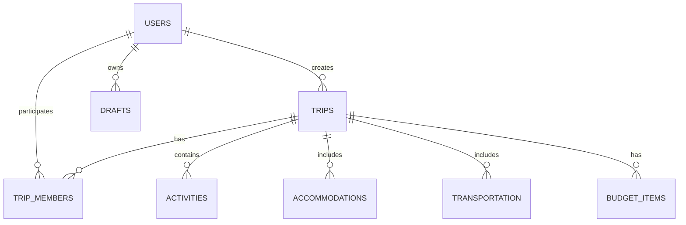

# Supabase Implementation Guide for Mapi

## Table of Contents
1. [Database Structure](#database-structure)
2. [Authentication Setup](#authentication-setup)
3. [Table Relationships](#table-relationships)
4. [API Implementation](#api-implementation)
5. [Migration Guide](#migration-guide)

## Database Structure

### Users Table
```sql
create table public.users (
  id uuid references auth.users on delete cascade not null primary key,
  email text not null unique,
  full_name text,
  avatar_url text,
  created_at timestamp with time zone default timezone('utc'::text, now()) not null,
  updated_at timestamp with time zone default timezone('utc'::text, now()) not null,
  
  constraint users_pkey primary key (id)
);

-- Enable RLS
alter table public.users enable row level security;

-- Create policies
create policy "Users can view their own profile" 
  on public.users for select 
  using ( auth.uid() = id );

create policy "Users can update their own profile" 
  on public.users for update 
  using ( auth.uid() = id );
```

### Trips Table
```sql
create table public.trips (
  id uuid default uuid_generate_v4() not null primary key,
  user_id uuid references public.users not null,
  name text not null,
  description text,
  start_date date,
  end_date date,
  status text default 'draft' check (status in ('draft', 'planned', 'completed', 'cancelled')),
  created_at timestamp with time zone default timezone('utc'::text, now()) not null,
  updated_at timestamp with time zone default timezone('utc'::text, now()) not null,
  
  constraint trips_pkey primary key (id)
);

-- Enable RLS
alter table public.trips enable row level security;

-- Create policies
create policy "Users can view their own trips" 
  on public.trips for select 
  using ( auth.uid() = user_id );

create policy "Users can create their own trips" 
  on public.trips for insert 
  with check ( auth.uid() = user_id );

create policy "Users can update their own trips" 
  on public.trips for update 
  using ( auth.uid() = user_id );

create policy "Users can delete their own trips" 
  on public.trips for delete 
  using ( auth.uid() = user_id );
```

### Trip Members Table
```sql
create table public.trip_members (
  id uuid default uuid_generate_v4() not null primary key,
  trip_id uuid references public.trips on delete cascade not null,
  user_id uuid references public.users on delete cascade not null,
  role text default 'member' check (role in ('owner', 'member', 'viewer')),
  status text default 'pending' check (status in ('pending', 'accepted', 'rejected')),
  created_at timestamp with time zone default timezone('utc'::text, now()) not null,
  updated_at timestamp with time zone default timezone('utc'::text, now()) not null,
  
  constraint trip_members_pkey primary key (id),
  constraint unique_trip_member unique (trip_id, user_id)
);

-- Enable RLS
alter table public.trip_members enable row level security;

-- Create policies
create policy "Members can view trip members" 
  on public.trip_members for select 
  using ( exists (
    select 1 from public.trip_members where trip_id = trip_members.trip_id and user_id = auth.uid()
  ));

create policy "Trip owners can manage members" 
  on public.trip_members for all 
  using ( exists (
    select 1 from public.trip_members 
    where trip_id = trip_members.trip_id 
    and user_id = auth.uid() 
    and role = 'owner'
  ));
```

### Activities Table
```sql
create table public.activities (
  id uuid default uuid_generate_v4() not null primary key,
  trip_id uuid references public.trips on delete cascade not null,
  name text not null,
  description text,
  location text,
  start_time timestamp with time zone,
  end_time timestamp with time zone,
  cost decimal(10,2),
  status text default 'planned' check (status in ('planned', 'completed', 'cancelled')),
  created_at timestamp with time zone default timezone('utc'::text, now()) not null,
  updated_at timestamp with time zone default timezone('utc'::text, now()) not null,
  
  constraint activities_pkey primary key (id)
);

-- Enable RLS
alter table public.activities enable row level security;

-- Create policies
create policy "Trip members can view activities" 
  on public.activities for select 
  using ( exists (
    select 1 from public.trip_members 
    where trip_id = activities.trip_id 
    and user_id = auth.uid()
  ));

create policy "Trip members can manage activities" 
  on public.activities for all 
  using ( exists (
    select 1 from public.trip_members 
    where trip_id = activities.trip_id 
    and user_id = auth.uid()
  ));
```

### Accommodations Table
```sql
create table public.accommodations (
  id uuid default uuid_generate_v4() not null primary key,
  trip_id uuid references public.trips on delete cascade not null,
  name text not null,
  address text,
  check_in timestamp with time zone,
  check_out timestamp with time zone,
  cost decimal(10,2),
  booking_reference text,
  notes text,
  created_at timestamp with time zone default timezone('utc'::text, now()) not null,
  updated_at timestamp with time zone default timezone('utc'::text, now()) not null,
  
  constraint accommodations_pkey primary key (id)
);

-- Enable RLS
alter table public.accommodations enable row level security;

-- Create policies similar to activities
```

### Transportation Table
```sql
create table public.transportation (
  id uuid default uuid_generate_v4() not null primary key,
  trip_id uuid references public.trips on delete cascade not null,
  type text check (type in ('flight', 'car', 'train', 'bus', 'other')),
  departure_location text,
  arrival_location text,
  departure_time timestamp with time zone,
  arrival_time timestamp with time zone,
  booking_reference text,
  cost decimal(10,2),
  notes text,
  created_at timestamp with time zone default timezone('utc'::text, now()) not null,
  updated_at timestamp with time zone default timezone('utc'::text, now()) not null,
  
  constraint transportation_pkey primary key (id)
);

-- Enable RLS
alter table public.transportation enable row level security;

-- Create policies similar to activities
```

### Budget Items Table
```sql
create table public.budget_items (
  id uuid default uuid_generate_v4() not null primary key,
  trip_id uuid references public.trips on delete cascade not null,
  category text not null,
  description text not null,
  amount decimal(10,2) not null,
  paid boolean default false,
  paid_by uuid references public.users,
  split_method text default 'equal' check (split_method in ('equal', 'percentage', 'fixed')),
  created_at timestamp with time zone default timezone('utc'::text, now()) not null,
  updated_at timestamp with time zone default timezone('utc'::text, now()) not null,
  
  constraint budget_items_pkey primary key (id)
);

-- Enable RLS
alter table public.budget_items enable row level security;

-- Create policies similar to activities
```

### Drafts Table
```sql
create table public.drafts (
  id uuid default uuid_generate_v4() not null primary key,
  user_id uuid references public.users on delete cascade not null,
  name text not null,
  content jsonb not null,
  type text not null,
  created_at timestamp with time zone default timezone('utc'::text, now()) not null,
  updated_at timestamp with time zone default timezone('utc'::text, now()) not null,
  
  constraint drafts_pkey primary key (id)
);

-- Enable RLS
alter table public.drafts enable row level security;

-- Create policies
create policy "Users can manage their own drafts"
  on public.drafts for all
  using ( auth.uid() = user_id );
```

## Authentication Setup

1. Enable Email Auth in Supabase Dashboard
2. Configure OAuth providers if needed (Google, Facebook, etc.)
3. Set up email templates for:
   - Confirmation
   - Reset password
   - Magic link

## Table Relationships



## API Implementation

### 1. Install Dependencies

```bash
yarn add @supabase/supabase-js
```

### 2. Environment Setup

Create `.env.local`:
```env
NEXT_PUBLIC_SUPABASE_URL=your-project-url
NEXT_PUBLIC_SUPABASE_ANON_KEY=your-anon-key
```

### 3. Supabase Client Setup

Create `src/lib/supabase.ts`:
```typescript
import { createClient } from '@supabase/supabase-js';

const supabaseUrl = process.env.NEXT_PUBLIC_SUPABASE_URL!;
const supabaseKey = process.env.NEXT_PUBLIC_SUPABASE_ANON_KEY!;

export const supabase = createClient(supabaseUrl, supabaseKey);
```

### 4. Type Definitions

Create `src/types/supabase.ts`:
```typescript
export type User = {
  id: string;
  email: string;
  full_name: string | null;
  avatar_url: string | null;
};

export type Trip = {
  id: string;
  user_id: string;
  name: string;
  description: string | null;
  start_date: string | null;
  end_date: string | null;
  status: 'draft' | 'planned' | 'completed' | 'cancelled';
  created_at: string;
  updated_at: string;
};

// Add other type definitions...
```

### 5. Auth Context

Create `src/context/AuthContext.tsx`:
```typescript
import { createContext, useContext, useEffect, useState } from 'react';
import { supabase } from '@/lib/supabase';
import { User } from '@supabase/supabase-js';

const AuthContext = createContext<{
  user: User | null;
  loading: boolean;
}>({
  user: null,
  loading: true,
});

export const AuthProvider = ({ children }: { children: React.ReactNode }) => {
  const [user, setUser] = useState<User | null>(null);
  const [loading, setLoading] = useState(true);

  useEffect(() => {
    // Check active sessions and sets the user
    supabase.auth.getSession().then(({ data: { session } }) => {
      setUser(session?.user ?? null);
      setLoading(false);
    });

    // Listen for changes on auth state (sign in, sign out, etc.)
    const { data: { subscription } } = supabase.auth.onAuthStateChange((_event, session) => {
      setUser(session?.user ?? null);
      setLoading(false);
    });

    return () => subscription.unsubscribe();
  }, []);

  return (
    <AuthContext.Provider value={{ user, loading }}>
      {children}
    </AuthContext.Provider>
  );
};

export const useAuth = () => {
  return useContext(AuthContext);
};
```

### 6. API Services

Create service files for each entity:

`src/services/auth.ts`:
```typescript
import { supabase } from '@/lib/supabase';

export const authService = {
  async signUp(email: string, password: string) {
    return await supabase.auth.signUp({ email, password });
  },

  async signIn(email: string, password: string) {
    return await supabase.auth.signInWithPassword({ email, password });
  },

  async signOut() {
    return await supabase.auth.signOut();
  },

  async resetPassword(email: string) {
    return await supabase.auth.resetPasswordForEmail(email);
  }
};
```

`src/services/trips.ts`:
```typescript
import { supabase } from '@/lib/supabase';
import { Trip } from '@/types/supabase';

export const tripService = {
  async getTrips() {
    const { data, error } = await supabase
      .from('trips')
      .select('*')
      .order('created_at', { ascending: false });
    
    if (error) throw error;
    return data as Trip[];
  },

  async getTrip(id: string) {
    const { data, error } = await supabase
      .from('trips')
      .select(`
        *,
        trip_members(*),
        activities(*),
        accommodations(*),
        transportation(*),
        budget_items(*)
      `)
      .eq('id', id)
      .single();
    
    if (error) throw error;
    return data as Trip;
  },

  async createTrip(trip: Omit<Trip, 'id' | 'created_at' | 'updated_at'>) {
    const { data, error } = await supabase
      .from('trips')
      .insert(trip)
      .select()
      .single();
    
    if (error) throw error;
    return data as Trip;
  },

  async updateTrip(id: string, trip: Partial<Trip>) {
    const { data, error } = await supabase
      .from('trips')
      .update(trip)
      .eq('id', id)
      .select()
      .single();
    
    if (error) throw error;
    return data as Trip;
  },

  async deleteTrip(id: string) {
    const { error } = await supabase
      .from('trips')
      .delete()
      .eq('id', id);
    
    if (error) throw error;
  }
};
```

Create similar service files for other entities (activities, accommodations, etc.).

### 7. Integration with Components

Update your components to use the new Supabase services. Example:

```typescript
// src/components/trips/ExpandedTripItem.tsx
import { useEffect, useState } from 'react';
import { tripService } from '@/services/trips';
import { Trip } from '@/types/supabase';

export const ExpandedTripItem = ({ tripId }: { tripId: string }) => {
  const [trip, setTrip] = useState<Trip | null>(null);
  const [loading, setLoading] = useState(true);

  useEffect(() => {
    const loadTrip = async () => {
      try {
        const data = await tripService.getTrip(tripId);
        setTrip(data);
      } catch (error) {
        console.error('Error loading trip:', error);
      } finally {
        setLoading(false);
      }
    };

    loadTrip();
  }, [tripId]);

  if (loading) return <div>Loading...</div>;
  if (!trip) return <div>Trip not found</div>;

  return (
    // Your trip display component
  );
};
```

## Migration Guide

1. **Database Migration**
   - Export existing data (if any)
   - Run SQL scripts to create tables
   - Import data into new tables
   - Verify data integrity

2. **Code Updates**
   - Update all API calls to use Supabase client
   - Implement new authentication flow
   - Update types and interfaces
   - Test all CRUD operations

3. **Testing**
   - Test authentication flow
   - Test all API endpoints
   - Verify row level security
   - Test real-time subscriptions
   - Verify data relationships

4. **Deployment**
   - Update environment variables
   - Deploy database changes
   - Deploy application updates
   - Monitor for any issues

## Next Steps

1. Implement real-time subscriptions for collaborative features
2. Set up automated backups
3. Configure monitoring and alerts
4. Implement caching strategy
5. Set up CI/CD pipeline with Supabase previews